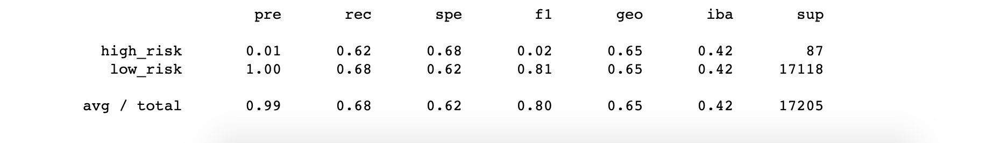
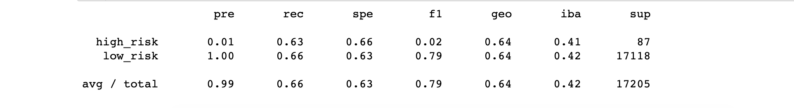
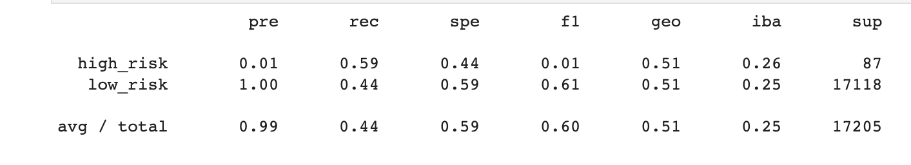
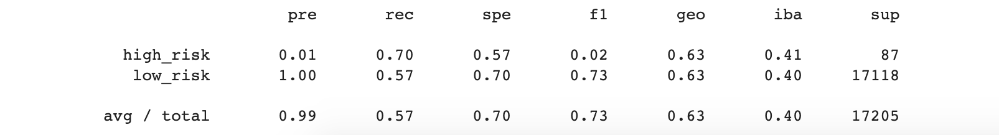
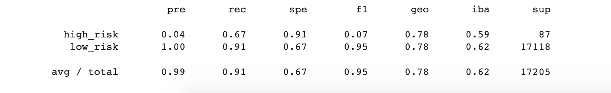
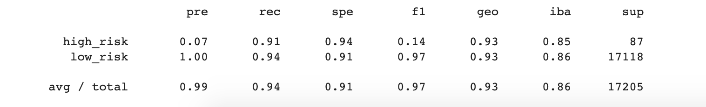

# Credit_Risk_Analysis
## Purpose 
The purpose of this analysis is to employ different techniques to train and evaluate models with Unbalanced classes by using imbalanced-learn and scikit-learn. For this challenge, I oversampled the credit data using RandomOverSampler and SMOTE. I also undersampled the data using the using the ClusterCentroids algorithm and SMOTEENN. Finally, I analysed the data and comared the two algorthms to predict credit risk. 

### Deliverable 1: Use Resampling Models to Predict Credit Risk
For Deliverable 1, I was tasked with evaulating three machine learning models by using resampling to determine if any of the models (RandomOverSampling, SMOTE, and CLusterCentroids) are better at determining credit risk.

#### RandomOverSampling Results

#### SMOTE Results

#### ClusterCentroid Results

## Results
- Accuracy: 
  - RandomOverSampling had a score of 0.65
  - SMOTE had a score of 0.64
  - ClusterCentroid had teh lowest score of 0.53
- Precision: The precision between all three models remained unaffected.
- Recall Score: The RandomOverSampling model had a mich higher score than SMOTE and the lowest recall score was from the ClusterCentroid with a recall score of 0.44

### Deliverable 2: Use the SMOTEENN Algorithm to Predict Credit Risk
For Deliverable 2, I used the combined approach of over and under-sampling with the SMOTEENN algorithm to determine if the if these results form a better approach at predicting the results from Deliverable 1.

#### SMOTEENN Results

## Results
- Accuracy: The accuracy of the SMOTEENN is 0.64
- Precision: The precision is 0.99
- Recall Score: The recal score is 0.57

### Deliverable 3: Use Ensemble Classifiers to Predict Credit Risk
For Deliverable 3, I used the imblearn.ensemble library to train and compare two different classifiers (BalancedRandomForestClassifier, and EasyEnsembleClassifier) to predit credit risk.

#### BalancedRandomForestClassifier Results

#### EasyEnsembleClassifier Results

## Results
- Accuracy: The EasyEnsemble model scored the highest with 0.92 accuracy while the BalancedRandomForestClassifier had a score of 0.79
- Precision: The precision for both of the models is 0.99
- Recall Scores: The recall scores were close to each other with a recall score from the BalancedRandomForestClassifier being a 0.91 and the EasyEnsemble score being a 0.94

## Summary 
Out of all six models we worked with, I think the best model is the EasyEnsembleClassifier model simply due to the fact that it scoared above 90% for the accuracy, precision as well as the recall scores. Even though some of the other models had a similar overall precision (such as BalancedRandomForestClassifier, and the SMOTEENN models) the EasyEnsembleClassifier had a much higher overall score than the other models since the other models would have scores that dropped into the low 80s as well as even 70s or 60 score range. An example being that the BalancedRandomForestClassifier having an accuracy score of 0.79 and the recall score for the SMOTEENN model being as low as 0.57. The randomOverSampling, SMOTE, and ClusterCentroid models do not even compete with the EasyEnsembleClassifier due to the fact that the highest scores with those three models were in the 0.50 - 0.65 range. The best model to use to determine credit risk would easily be the EasyEmsenbleClassifer model.

## Resources 
- Jupyter Notebook
- Pandas
- mnlev
